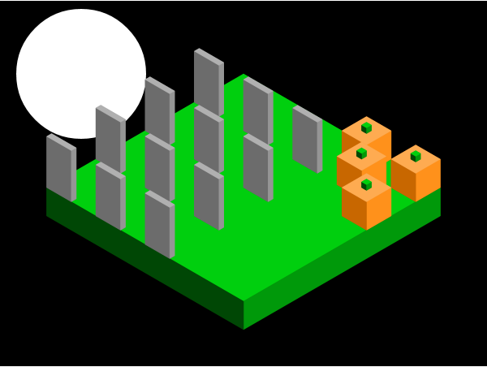

# Hallowscene

### A Halloween scene kit for [isomer](https://github.com/jdan/isomer)

## What's in the kit?
Currently, the kit contains:
  * colors
  * pumpkins
  * moons
  * tombtones
  * **more coming soon!**

## How do I use it?
Create a new Hallowscene using your isomer object.

```js
var iso = new Isomer(document.getElementById("hallowscene")),
    hallowscene = new Hallowscene(iso);
    
hallowscene.addMoon(200, 180, 160);
iso.add(Isomer.Shape.Prism(Isomer.Point.ORIGIN, 8, 8, 1),  hallowscene.colors.green); // create the scene platform
hallowscene.addTombstone(1, 8, 0);
hallowscene.addPumpkin(8, 1, 0);
```
